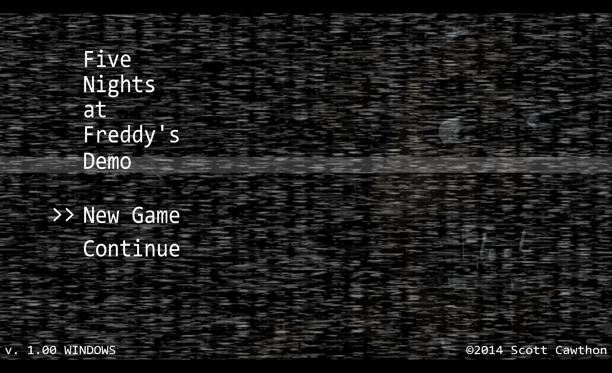

# Vita FNAF1

Remake of FNAF1 targeted towards the PSVita.

Also runs on Windows, Linux and on the web using Emscriptem.

Obviously the used assets are not owned by me and are under the copyright of the original creator, Scott Cawthon.

The source code is licensed under GPL v3.0.

## Preview:

## Compilation details:

For more info there's also the [workflows](./.github/workflows/).

### PSVita:

- using the same repo, make a SDL3 build that supports GLES 2.0 using the flags specified [here](https://github.com/libsdl-org/SDL/blob/main/docs/README-vita.md).
- make your own SDL3_mixer build using [the packages repo](https://github.com/vitasdk/packages).
- make sure you got all the [PSP2_PVR](https://github.com/GrapheneCt/PVR_PSP2) modules from the release in the assets/modules folder.

### Unix:

- This works out the box if you got all the packages installed.

### Web through Emscripten

- This works out of the box.
- Make sure you are not running index.html directly in the browser as browsers are not a fan of loading wasm locally.

#### Homage to my [old project,](https://github.com/ghostnear/VitaFNAF1)

---

<a href="https://brainmade.org/">
    Made with <3 by a human.
    
</a>
